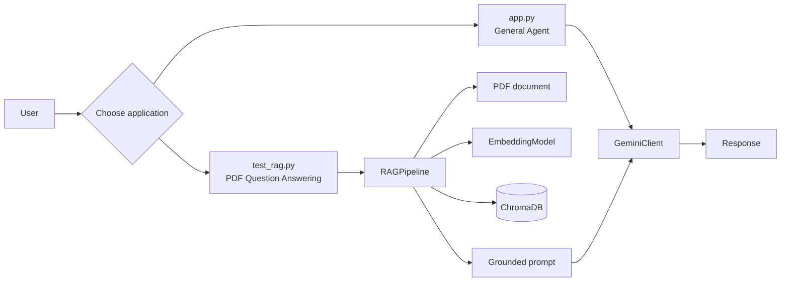
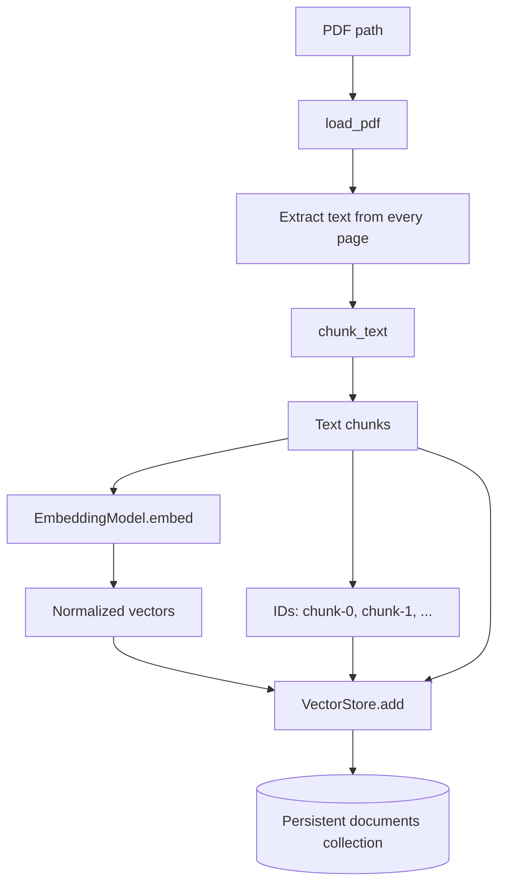
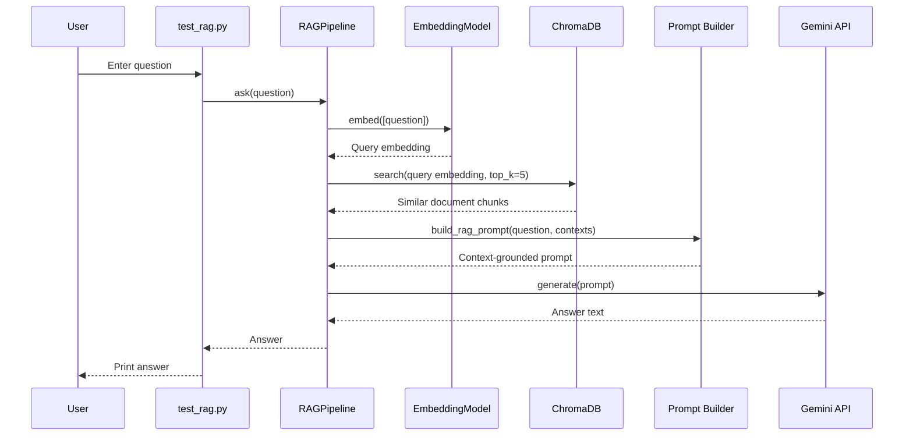
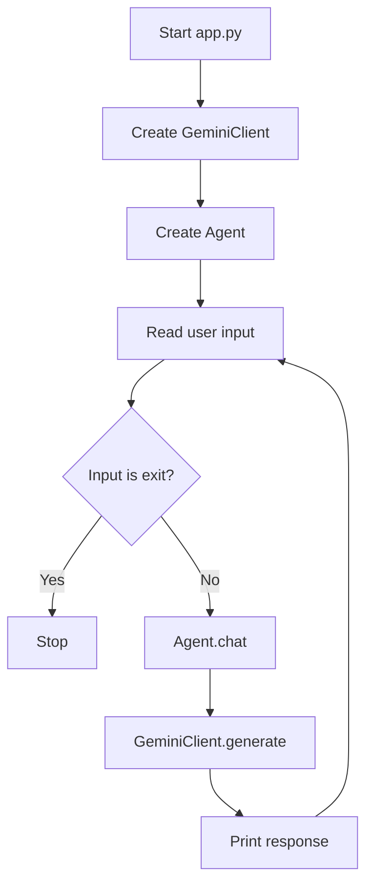
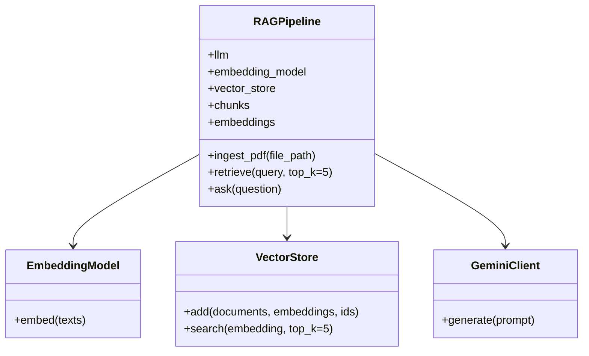

# Build RAG Application Guide

This document explains how the Build RAG application works, how its files connect, which libraries it uses, and the important Python syntax and methods used in the project.

## 1. What the Application Does

Build RAG has two application modes:

1. **General AI Agent**: accepts a user message and sends it directly to Google Gemini.
2. **PDF RAG**: reads a PDF, splits its text into chunks, converts the chunks into embedding vectors, stores them in ChromaDB, retrieves relevant chunks for a question, and asks Gemini to produce a grounded answer.

RAG means **Retrieval-Augmented Generation**. Instead of asking the language model to answer from general knowledge alone, the application retrieves relevant content from the user's document and adds it to the prompt.



## 2. Project Structure

```text
build_rag/
├── app.py                         # Starts the general AI agent
├── test_rag.py                    # Starts the PDF RAG application
├── requirements.txt               # Pinned Python libraries
├── .env                           # Secret configuration, not committed
├── .gitignore                     # Files excluded from Git
├── docs/                          # Input PDF documents
├── chroma_db/                     # Persistent ChromaDB data
├── info/
│   └── application-guide.md       # This documentation
├── agent/
│   └── agent.py                   # Simple LLM chat wrapper
├── llm/
│   ├── base.py                    # Abstract LLM contract
│   └── gemini.py                  # Google Gemini implementation
├── rag/
│   ├── loader.py                  # PDF text extraction
│   ├── chunker.py                 # Text chunking
│   ├── embeddings.py              # Text-to-vector conversion
│   ├── vector_store.py            # ChromaDB storage and search
│   ├── prompt.py                  # RAG prompt creation
│   └── pipeline.py                # Complete RAG orchestration
└── tools/                         # Reserved for future tools
```

## 3. End-to-End RAG Workflow

### 3.1 Document indexing

Indexing happens before the user asks questions.



The pipeline does these operations in order:

1. Open the PDF.
2. Extract text from each page.
3. Split the text into overlapping chunks.
4. Convert every chunk into a numeric embedding.
5. Create an ID for each chunk.
6. Store the chunk, embedding, and ID in ChromaDB.

### 3.2 Question answering



The important design idea is that the question and document chunks are embedded with the same model. ChromaDB can then compare the query vector with the stored vectors and return semantically similar text.

## 4. Entry Points

### `app.py`

`app.py` runs the direct agent mode:

```python
llm = GeminiClient()
agent = Agent(llm)

while True:
    user_input = input("You: ")
    if user_input.lower() == "exit":
        break
    response = agent.chat(user_input)
    print(response)
```

Execution flow:



This mode does **not** read the PDF, create embeddings, or search ChromaDB. It sends the user message directly to Gemini.

### `test_rag.py`

`test_rag.py` runs the document-question-answering mode:

```python
llm = GeminiClient()
rag = RAGPipeline(llm)
count = rag.ingest_pdf("docs/document.pdf")

while True:
    question = input("Question: ")
    if question.lower() == "exit":
        break
    print(rag.ask(question))
```

The current script also prints every chunk and its full embedding vector for inspection.

## 5. RAG Modules and Important Functions

### 5.1 `rag/loader.py`

```python
import pymupdf


def load_pdf(file_path: str) -> str:
    document = pymupdf.open(file_path)
    text = ""

    for page in document:
        text += page.get_text()

    document.close()
    return text
```

#### `load_pdf(file_path)`

- **Input**: a string containing a PDF path.
- **Operation**: opens the PDF and reads every page.
- **Output**: one string containing all extracted text.
- **Library**: `pymupdf`.

Important Python syntax:

- `import pymupdf` imports the PDF library.
- `file_path: str` is a type annotation saying the argument should be a string.
- `-> str` says the function returns a string.
- `for page in document` loops over PDF pages.
- `text += ...` appends text to the existing string.

### 5.2 `rag/chunker.py`

```python
def chunk_text(
    text: str,
    chunk_size: int = 1000,
    overlap: int = 200
) -> list[str]:
    chunks = []
    start = 0

    while start < len(text):
        end = start + chunk_size
        chunks.append(text[start:end])
        start += chunk_size - overlap

    return chunks
```

#### `chunk_text(text, chunk_size, overlap)`

This uses character-based chunking:

- Each chunk is at most 1,000 characters by default.
- The next chunk starts 800 characters later.
- Therefore, adjacent chunks overlap by 200 characters.
- The overlap helps preserve context between chunk boundaries.

Python syntax:

- `list[str]` means a list containing strings.
- `chunk_size: int = 1000` gives a typed parameter with a default value.
- `text[start:end]` is Python slicing.
- `while` repeats until the whole text has been processed.

Example:

```text
Text length: 2,400 characters
Chunk size: 1,000
Overlap: 200

Chunk 1: characters 0-999
Chunk 2: characters 800-1799
Chunk 3: characters 1600-2399
```

### 5.3 `rag/embeddings.py`

```python
from sentence_transformers import SentenceTransformer


class EmbeddingModel:
    def __init__(self):
        self.model = SentenceTransformer("all-MiniLM-L6-v2")

    def embed(self, texts: list[str]):
        return self.model.encode(
            texts,
            normalize_embeddings=True
        )
```

#### `EmbeddingModel.__init__()`

Loads the local Sentence Transformer model named `all-MiniLM-L6-v2`. The model is downloaded the first time it is used and cached afterward.

#### `EmbeddingModel.embed(texts)`

Converts one or more strings into numerical vectors.

```text
Text:       "The company provides paid leave."
                 |
                 v
Embedding:  [0.021, -0.114, 0.083, ...]
```

`normalize_embeddings=True` normalizes the output vectors, which makes similarity comparisons more consistent.

The vectors are NumPy arrays. Before ChromaDB stores them, `VectorStore.add()` changes them into regular Python lists with `.tolist()`.

### 5.4 `rag/vector_store.py`

```python
import chromadb


class VectorStore:
    def __init__(self):
        self.client = chromadb.PersistentClient(path="./chroma_db")
        self.collection = self.client.get_or_create_collection(
            name="documents"
        )
```

#### `VectorStore.__init__()`

- Creates a persistent ChromaDB client.
- Saves data under `./chroma_db`.
- Gets the existing `documents` collection or creates it.
- The path is relative to the terminal's current working directory.

#### `add(documents, embeddings, ids)`

```python
self.collection.add(
    documents=documents,
    embeddings=embeddings.tolist(),
    ids=ids
)
```

Stores the document text, embedding vectors, and unique IDs together.

#### `search(embedding, top_k=5)`

```python
return self.collection.query(
    query_embeddings=[embedding.tolist()],
    n_results=top_k
)
```

Searches for the closest stored vectors and returns the matching documents. The current default returns five results.

### 5.5 `rag/prompt.py`

```python
def build_rag_prompt(question: str, contexts: list[str]) -> str:
    context = "\n\n---\n\n".join(contexts)

    return f"""
You are a helpful AI assistant.

Answer the user's question using ONLY the provided context.

Context:
{context}

User question:
{question}
"""
```

#### `build_rag_prompt(question, contexts)`

- Joins retrieved chunks with separators.
- Inserts them into a formatted prompt.
- Tells Gemini not to invent information.
- Tells Gemini to admit when the context does not contain an answer.

Python syntax:

- `"\n\n---\n\n".join(contexts)` joins list items into one string.
- `f"""..."""` is a multiline f-string.
- `{context}` and `{question}` insert variable values into the string.

### 5.6 `rag/pipeline.py`

`RAGPipeline` coordinates all RAG components.



#### `RAGPipeline.__init__(llm)`

Creates and stores:

- The LLM client.
- The embedding model.
- The vector store.
- Empty `chunks` and `embeddings` values used by `test_rag.py` for inspection.

#### `RAGPipeline.ingest_pdf(file_path)`

```python
text = load_pdf(file_path)
chunks = chunk_text(text)
embeddings = self.embedding_model.embed(chunks)
self.vector_store.add(
    documents=chunks,
    embeddings=embeddings,
    ids=ids
)
return len(chunks)
```

This is the complete indexing method. It returns the number of chunks indexed.

#### `RAGPipeline.retrieve(query, top_k=5)`

1. Embeds the user's query.
2. Selects the first query embedding with `[0]`.
3. Searches ChromaDB.
4. Returns the documents from the first result set.

#### `RAGPipeline.ask(question)`

```python
contexts = self.retrieve(question)
prompt = build_rag_prompt(question, contexts)
return self.llm.generate(prompt)
```

This is the complete answer method: retrieve, build prompt, generate.

## 6. LLM Modules

### 6.1 `llm/base.py`

```python
from abc import ABC, abstractmethod


class BaseLLM(ABC):
    @abstractmethod
    def generate(self, prompt: str) -> str:
        pass
```

`BaseLLM` defines a contract for language-model clients.

- `ABC` means Abstract Base Class.
- `@abstractmethod` requires subclasses to implement `generate()`.
- The application can use the same method name for different LLM providers.

### 6.2 `llm/gemini.py`

#### `GeminiClient.__init__()`

```python
load_dotenv()
api_key = os.getenv("GEMINI_API_KEY")

if not api_key:
    raise ValueError("GEMINI_API_KEY is not set...")

self.client = genai.Client(api_key=api_key)
```

The constructor:

1. Loads variables from `.env`.
2. Reads `GEMINI_API_KEY`.
3. Raises a clear error if the key is missing.
4. Creates the Google GenAI client.

#### `_model_candidates()`

The class defines an ordered list of Gemini model names. It asks the API which models are available, keeps models that support `generateContent`, and combines them with the configured list.

The leading underscore in `_model_candidates` indicates that it is intended as an internal helper method.

#### `generate(prompt)`

```python
for model in self._model_candidates():
    try:
        response = self.client.models.generate_content(
            model=model,
            contents=prompt,
        )
        return response.text
    except errors.APIError:
        print("Trying the next model...")

raise RuntimeError("All configured Gemini models failed.")
```

This is a fallback strategy. If one configured model fails with an API error, the client tries the next model instead of stopping immediately.

## 7. Agent Module

### `agent/agent.py`

```python
from llm.base import BaseLLM


class Agent:
    def __init__(self, llm: BaseLLM):
        self.llm = llm

    def chat(self, message: str) -> str:
        return self.llm.generate(message)
```

#### `Agent.chat(message)`

Forwards the message to the selected LLM. This class is intentionally small. It provides a place to add memory, tools, or agent behavior later without changing `app.py`.

The agent mode and RAG mode are different:

```text
Agent mode:  user message -> Gemini -> response
RAG mode:    user question -> embedding -> search -> context -> Gemini -> response
```

## 8. Libraries and Their Roles

| Library | Used for | Main usage |
|---|---|---|
| `pymupdf` | PDF extraction | `pymupdf.open()` and `page.get_text()` |
| `sentence-transformers` | Semantic embeddings | `SentenceTransformer()` and `.encode()` |
| `chromadb` | Persistent vector database | `PersistentClient()`, `.add()`, `.query()` |
| `google-genai` | Gemini API access | `genai.Client()` and `generate_content()` |
| `python-dotenv` | Environment variables | `load_dotenv()` |
| `numpy` | Embedding array representation | `.tolist()` before database storage |
| `torch` | Model runtime dependency | Used by Sentence Transformers |
| `transformers` | Transformer model support | Used by Sentence Transformers |
| `tokenizers` | Fast text tokenization | Transformer model dependency |
| `scikit-learn` and `scipy` | Numerical and ML support | Supporting dependencies |
| `tqdm` | Progress display | Model-loading progress |

## 9. Environment and Commands

### Windows Command Prompt

```cmd
cd /d D:\build_rag
venv\Scripts\activate
python -m pip install -r requirements.txt
```

Run the direct agent:

```cmd
python app.py
```

Run the PDF RAG application:

```cmd
python test_rag.py
```

Exit the virtual environment:

```cmd
deactivate
```

### PowerShell

```powershell
cd D:\build_rag
Set-ExecutionPolicy -Scope Process -ExecutionPolicy RemoteSigned
.\venv\Scripts\Activate.ps1
python -m pip install -r requirements.txt
```

## 10. Configuration

Create `.env` in the project root:

```env
GEMINI_API_KEY=your_gemini_api_key
```

The `.gitignore` file excludes `.env`, so the key should not be committed. Do not write API keys directly into Python files.

The Hugging Face token is optional for the public embedding model. In Command Prompt, a token can be set for the current terminal session with:

```cmd
set HF_TOKEN=your_huggingface_token
```

## 11. Inspecting Chunks and Embeddings

`test_rag.py` stores the current indexing results on the pipeline:

```python
rag.chunks
rag.embeddings
```

The script prints them with:

```python
for index, (chunk, embedding) in enumerate(
    zip(rag.chunks, rag.embeddings),
    start=1
):
    print(f"--- Chunk {index} ---")
    print(chunk)
    print(embedding.tolist())
```

`zip()` pairs the first chunk with the first embedding, the second chunk with the second embedding, and so on. `enumerate(..., start=1)` adds a human-friendly number.

Because each chunk has a large vector, printing all embeddings can produce a very large terminal output.

## 12. Important Current Limitations

- Chunking is character-based, not paragraph- or token-aware.
- The vector database uses fixed IDs such as `chunk-0`. Re-indexing the same document may cause duplicate-ID errors in the persistent collection.
- ChromaDB is stored in `./chroma_db`, so the command should normally be run from the project root.
- Retrieval currently returns document text but not page numbers or similarity scores.
- Reranking, context filtering, and source citations are not currently implemented.
- The direct agent does not use document retrieval.
- Printing complete embedding vectors is useful for learning but not ideal for normal application output.

## 13. Troubleshooting

### PDF file not found

Run from the project root and check the PDF name:

```cmd
cd /d D:\build_rag
dir docs
```

The path in `test_rag.py` must exactly match the real filename.

### Missing Gemini API key

Verify that `.env` exists in `D:\build_rag` and contains:

```env
GEMINI_API_KEY=your_gemini_api_key
```

### Missing Python package

Activate the virtual environment and install the requirements:

```cmd
venv\Scripts\activate
python -m pip install -r requirements.txt
```

### Check Python syntax without running the application

```cmd
python -m py_compile app.py test_rag.py
```

For the package modules in PowerShell:

```powershell
$files = @('app.py', 'test_rag.py') + (Get-ChildItem rag, agent, llm -Filter *.py -File -Recurse | Select-Object -ExpandProperty FullName)
.\venv\Scripts\python.exe -m py_compile $files
```

## 14. Summary

```text
PDF
  -> extracted text
  -> overlapping chunks
  -> embedding vectors
  -> ChromaDB
  -> similar chunks for a question
  -> grounded Gemini prompt
  -> answer
```

The central class is `RAGPipeline`. Its three most important methods are:

```text
ingest_pdf()  -> builds the searchable document index
retrieve()    -> finds relevant document chunks
ask()         -> retrieves context and generates the final answer
```
